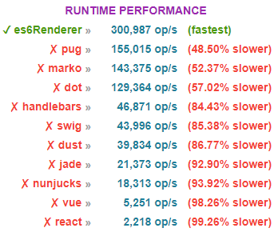

Express ES6 string template engine
======

ES6 Renderer is simple, super fast, and extendable Template Engine for Node and Express applications which uses pure ES6 Javascript syntax.
It works by scanning files in a working directory, then reading the contents of the files and converting them from plain strings to ES6 template strings. ES6 template strings are string literals enclosed by the back-tick. They feature String Interpolation, Embedded Expressions, Multiline strings and String Tagging for safe HTML escaping, localisation, etc. Once convertion is completed its then compiled to plain text by the V8 engine, harnessing 100% of its power. Being less than 1kb, ES6 Renderer offloads a lot of the processing directly to the V8 interpreter, which compiles the code and runs as fast as the rest of the Express App. In fact, ES6 Renderer shouldn't add any overhead to the project at all! It should also allow us to implement any functionality we like within the bounds of Javascript.

Minimum requirements Node.js `v4.0.0`.

[](https://www.npmjs.com/package/express-es6-template-engine)

### Benchmarks

Testing ES6 Renderer performance was a great opportunity to see how it stacked-up beside others. Our speed test compiled one main template containing an array of string, an object literal and conditional statements.



### Installation

```bash
$ npm i express-es6-template-engine --save
```

### Features

* No Dependencies
* Fully Configurable
* Compiled and interpreted by V8 (Super Fast)
* Learning new syntax is not required
* Partials Support
* Conditional Support
* Iterators Support
* Native Javascript Support

### Usage

#### Prerequisites

List of used html files in the `views` folder:

`index.html`

```html
<!DOCTYPE html>
<html>
<body>
    <h1>${title}</h1>
</body>
</html>
```

`template.html`

```html
<!DOCTYPE html>
<html>
<body>
    <h1>${title}</h1>
    <main>${partial}</main>
</body>
</html>
```

`partial.html`

```html
<p>The fastest javascript template string engine!</p>
```

`partial-conditional.html`

```html
ES6 Renderer is ${maintainedBy ? `a template engine maintained by ${maintainedBy}` : 'not maintained anymore'}.
```

`partial-iteration.html`

```html
<dl>
  ${features.map(f => `
    <dt>${f.dt}</dt>
    <dd>${f.dd}</dd>
  `).join('')}
</dl>
```

#### Setup with Express

The basics required to integrate ES6 renderer in your app are pretty simple and easy to implement:

```javascript
const express = require('express'),
  es6Renderer = require('express-es6-template-engine'),
  app = express();
  
app.engine('html', es6Renderer);
app.set('views', 'views');
app.set('view engine', 'html');

app.get('/', function(req, res) {
  res.render('index', {locals: {title: 'Welcome!'}});
});

app.listen(3000);
```

Before Express can render template files, the following application settings must be set:

- views, the directory where the template files are located. Eg: app.set('views', './views')
- view engine, the template engine to use. Eg: app.set('view engine', 'html')

HTML template file named `index.html` in the views directory is needed (the content of the file can be found in the prerequisites section). Route to render the html file is expected. If the view engine property is not set, we must specify the extension of the view file. Otherwise, it can be safely omitted.

```javascript
app.render('index', {locals: {title: 'ES6 Renderer'}});
```

Express-compliant template engines such as ES6 Renderer export a function named __express(filePath, options, callback), which is called by the res.render() function to render the template code. When a request is made to the home page, the index.html file will be rendered as HTML.

#### Setup without Express

To get up and running without having to worry about managing extra libraries one only needs the following:

```javascript
const es6Renderer = require('express-es6-template-engine');
es6Renderer(
    __dirname + '/views/index.html',
    { locals: { title:  'ES6 Renderer' } },
    (err, content) => err || content
);
```

The content below will be rendered on the client side as a response from both setups:

```html
<!DOCTYPE html>
<html>
<body>
    <h1>ES6 Renderer</h1>
</body>
</html>
```

#### Rendering a template

Within your app route callback, call `res.render`, passing any partials and local variables required by your template. For example:

```javascript
app.get('/', function(req, res) {
  res.render('template', {
      locals: {
        title:  'ES6 Renderer'
      },
      partials: {
        partial: __dirname + '/views/partial'
      }
  });
});
```

Partial with a file name `partial.html` (see the content of the file in the prerequisites section above) will be injected into `template.html`:

```html
<!DOCTYPE html>
<html>
<body>
    <h1>ES6 Renderer</h1>
    <main><p>The fastest javascript template string engine!</p></main>
</body>
</html>
```

All templates files paths are defined as absolute to the root directory of the project.

#### Compiling a string

ES6 Renderer rendering functionality has separate scanning, parsing, string generation and response sending phases. Compilation is pretty much the same but without the response sending phase. This feature can be useful for pre-processing templates on the server.
Compiling has the following syntax:

```javascript
const titleTpl = '${engineName} - The fastest javascript template string engine!';
const cb = (err, content) => err || content;

// sync - second parameter is a string representation of an array of variable names.
// The returned function is called with a string representation of an array of variable values.
const compiled = es6Renderer(titleTpl, 'engineName')('ES6 Renderer');
// async - second parameter is an object and third parameter is a callback function
es6Renderer(titleTpl,{ template: true, locals:{ engineName: 'ES6 Renderer' } }, cb);
```
Both methods will result in the following output:

```
ES6 Renderer - The fastest javascript template string engine!
```
The template engine allows both synchronous and asynchronous method invocations. If string is rendered as in the examples provided above a 'template' option needs to be set to true. The preceding synchronous invocation returns an output immediately in response to the function execution. Alternatively, you can specify partials and omit template parameter to force file lookup and content reading and invoke the function asynchronously. 


#### Compiling a template

The two functions `app.render` and `es6Renderer` are almost identical, but they require slightly different parameters to be passed. While `app.render` uses an absolute path, or a path relative to the views setting, `es6Renderer` expects a path relative to root folder.
They both return the rendered content of a view via the callback function. The callback function which is provided as a third parameter is called once the asynchronous activity is completed. The output in the two examples provided below is the same:

```javascript
app.render('template', {
  locals: {
    title:  'ES6 Renderer'
  },
  partials: {
    template: __dirname + '/views/partial'
  }
}, (err, content) => err || content);
```
```javascript
es6Renderer(__dirname + '/views/template.html', {
  locals: {
    title:  'ES6 Renderer'
  },
  partials: {
    template: __dirname + '/views/partial.html'
  }
}, (err, content) => err || content);
```
On average `es6Renderer` yields slightly better performance than `app.render`. Async function invocation of `es6Renderer` also returns a promise, which enables us to chain method calls:
```javascript
const compile = es6Renderer(__dirname + '/views/template.html', {
  locals: {
    title:  'ES6 Renderer'
  },
  partials: {
    template: __dirname + '/views/partial.html'
  }
}, (err, content) => err || content);
compile.then(output => res.send(output))
```

#### Compiling a nested template

Template nesting is currently not supported by the engine. A simple workaround to this issue would be to perform multiple template compilations:

```javascript
const renderPage = (err, content) => res.render('template', {
  locals: {
    partial: content
  }
});
es6Renderer(__dirname + '/views/partial-conditional.html', {
  locals: {
    maintainedBy:  'Good Samaritans'
  }
}, renderPage);
```
#### Precompiling

ES6 Renderer allows us bypassing Express view rendering for speed and modularity. Compiling a template is much slower than rendering it, so when it comes to speed, we should precompile our templates as part of the optimisation process. The result of precompilation can be stored to an object:
```javascript
const text = '${engineName} - The fastest javascript template string engine in the whole ${place}!';
const precompiled = es6Renderer(text, 'engineName, place');
```
and then invoked whenever needed:
```javascript
console.log(precompiled('ES6 Renderer', 'multiverse'));
```
To make use of this precompilation, templates should be compiled with names that the compiler would expect and the result function called with an argument list that consists of values relative to the names. If no property name is defined a default one is created with a value of '$': 
```javascript
const text = '${$.engineName} - The fastest javascript template string engine in the whole ${$.place}!';
console.log(es6Renderer(text)({ engineName: 'ES6 Renderer', place: 'multiverse' });
```
This allows us to create an application that is more flexible, independent from a framework, easier to understand and better performing.


#### Conditional statements

ES6 Renderer dynamically evaluates code in JavaScript. If the argument is an expression, ES6 Renderer evaluates the expression. If the argument is one or more JavaScript statements, the engine executes the statements. A simplified example of using conditional statement is presented below.

A route path on the server side:

```javascript
res.render('partial-conditional', {
    locals: {
      maintainedBy:  'Good Samaritans'
    }
  });
```

Will result in the following:

```html
ES6 Renderer is a template engine maintained by Good Samaritans.
```

#### Iterators

Iterating over arrays and objects is quite straight forward and intuitive (knowledge of basic javascript here is essential). An object literal is passed to a html template:

```javascript
res.render('partial-iteration', {
    locals: {
      features:  [
      { 
        dt: 'Multi-line strings', 
        dd: 'Any new line characters inserted in the source are part of the template string.' 
      },
      { 
        dt: 'Expression interpolation', 
        dd: 'Template strings can contain placeholders. These are indicated by dollar sign and curly braces.' 
      },
    ]
    }
  });
```

The following is received by the client side:

```html
<dl>
    <dt>Multi-line strings</dt>
    <dd>Any new line characters inserted in the source are part of the template string.</dd>
    <dt>Expression interpolation</dt>
    <dd>Template strings can contain placeholders. These are indicated by dollar sign and curly braces.</dd>
</dl>
```

#### Error Handling

ES6 Renderer catches and processes errors that occur both synchronously and asynchronously. ES6 Renderer comes with a default error handler so you don’t need to write your own to get started.
Errors that occur in synchronous code require no extra work. If synchronous code throws an error, then ES6 Renderer will catch and process it. For example.

```javascript
const text = '${engineName} - The fastest javascript template string engine in the whole ${place}!';
const err = es6Renderer(text, 'engineName')('ES6 Renderer', 'multiverse');
expect(err instanceof Error).to.equal(true);
```

For errors returned from asynchronous functions, you must pass them to the callback function, where ES6 Renderer will catch and process them. A viable alternative will be to use native promise catch or reject methods. The example underneath handles both cases simultaneously:

```javascript
es6Renderer(
    __dirname + "/index.html",
    { locals: { engineName: "ES6 Renderer", footer: "MIT License" } },
    (err) => expect(err instanceof Error).to.equal(true);
).then((err) => expect(err instanceof Error).to.equal(true));
```

### License

MIT License

Copyright (c) 2015 Dian Dimitrov

Permission is hereby granted, free of charge, to any person obtaining a copy of this software and associated documentation files (the 'Software'), to deal in the Software without restriction, including without limitation the rights to use, copy, modify, merge, publish, distribute, sublicense, and/or sell copies of the Software, and to permit persons to whom the Software is furnished to do so, subject to the following conditions:

The above copyright notice and this permission notice shall be included in all copies or substantial portions of the Software.

THE SOFTWARE IS PROVIDED 'AS IS', WITHOUT WARRANTY OF ANY KIND, EXPRESS OR IMPLIED, INCLUDING BUT NOT LIMITED TO THE WARRANTIES OF MERCHANTABILITY, FITNESS FOR A PARTICULAR PURPOSE AND NONINFRINGEMENT. IN NO EVENT SHALL THE AUTHORS OR COPYRIGHT HOLDERS BE LIABLE FOR ANY CLAIM, DAMAGES OR OTHER LIABILITY, WHETHER IN AN ACTION OF CONTRACT, TORT OR OTHERWISE, ARISING FROM, OUT OF OR IN CONNECTION WITH THE SOFTWARE OR THE USE OR OTHER DEALINGS IN THE SOFTWARE.
